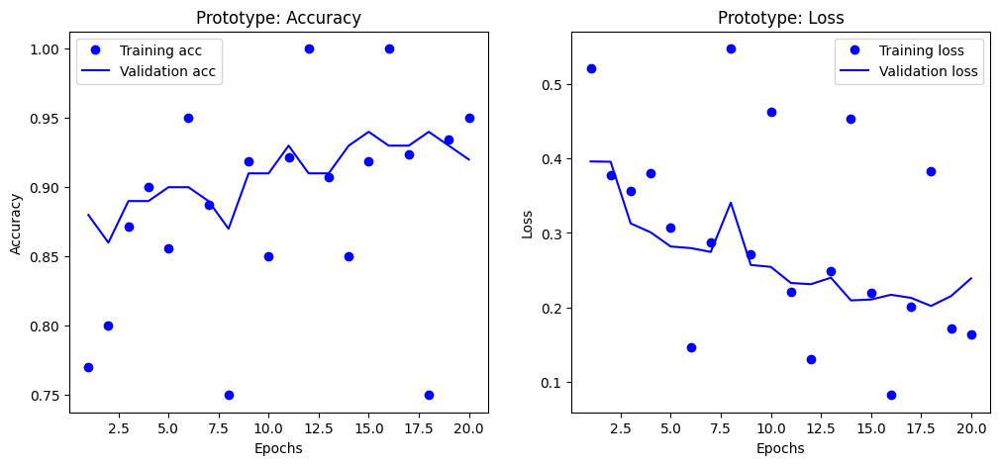
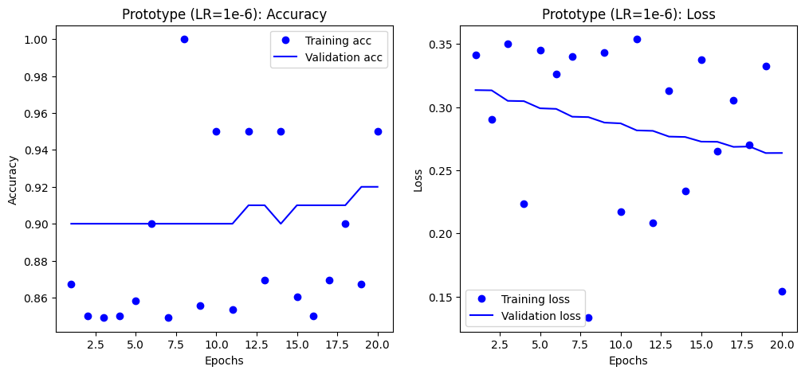

# Precipitation_Classification
This readme documents the machine learning process undertaken to create a binary classification model that can competently identify active precipitation in images. Images from a Kaggle weather dataset were organized into their respective categories, ***precipitation*** and ***no precipitation***. A VGG16 model was trained with transfer learning and techniques such as adding classification layers, early stopping, and learning rate were implemented in order to improve model performance and diagnose anomalies. 

## Overview
This project's aim was to use transfer learning to train a reliable binary classification model on weather images that can identify whether an image contains precipitation. The final model, selected using an early stopping technique to ensure peak performance, achieved an overall F1 Score of 0.92, which indicates an excellent balance between being cautious and being comprehensive.

| Metric | No Precipitation | Precipitation | Overall / Average |
| :--- | :--- | :--- | :--- |
| **Precision** | 0.89 | **0.96** | **0.93** (Weighted Avg) |
| **Recall** | **0.97** | 0.88 | **0.92** (Weighted Avg) |
| **F1-Score**| 0.93 | 0.92 | **0.92** (Weighted Avg) |
| **Accuracy**| - | - | **0.92** |

### Interpretation
When the Model Predicts "Precipitation": It is correct 96% of the time (Precision). This means you can have very high confidence in a rain forecast from this model. If it says it's going to rain, it almost certainly is. False alarms are UNLIKELY

When the Model Predicts "No Precipitation": It correctly identifies 97% of all actual non-rainy days (Recall). This means the model is exceptionally good at confirming clear weather. It almost never mistakes a non-rainy day for a rainy one.

The model successfully detects 88% of all actual rain events (Recall for Precipitation). This is its area with the most room for improvement. While it is very good, it means the model can be slightly cautious, occasionally missing a rain event that does occur.

## DATA
This project uses a weather dataset from kaggle [linked here](https://www.kaggle.com/datasets/muthuj7/weather-dataset). This Kaggle dataset is a weather image dataset organized into the image’s respective category (dew, fogsmog, frost, glaze, hail, lightning, rain, rainbow, rime, sandstorm, snow). Over 500 images were organized into training and validation folders each containing the two subcategories: precipitation and no precipitation. The images themselves are JPEG files. 

## Visuals
The primary visualizations used to assess model performance were accuracy and loss plots via MatPlotLib. These were created with every model, alongside evaluations scores Precision, Recall, F1-Score, and Accuracy. 

- **Feasibility Accuracy / Loss**


These initial feasibility plots show promise with no obvious overfitting and attractive train and validation trends that follow each other closely and move toward where they should. Of course, these are only 10 Epochs so this is a stable and successful baseline.

- **Prototype Accuracy / Loss**


The first prototype model, which unfroze part of the VGG16 base, immediately stands out as having erratic training accuracy and loss across all epochs. This could be due to a variety of things, though notably the validation accuracy and loss is showing tremendous stability. This means that the erratic behavior of the training data is not immediately necessary to address. We also see that the validation loss is a bit flat at the end. This presents a perfect opportunity to utilize **Early Stopping** from keras to avoid overfitting. 

- **Early Stopping Accuracy / Loss**


With Early Stopping implemented, we can see that training data has remained erratic. However, validation accuracy and loss are now more stably trending toward where they should be. The eval metrics results of this model confirm it is our most balanced, high performing, and reliable model.

- **Lower Learning Rate Accuracy / Loss**


Here the erratic training is officially addressed through lowering the learning rate tenfold. This had little to no effect on stability, which leaves me to believe that the instability is due to something more fundamental like the size of the dataset or the complexity of the unfrozen VGG16 model. Again, the priority here is that our validation metrics remain stable across epochs and this is something that all models more or less achieve, with the Early Stopping model achieving this the best.

## The Problem

The primary challenge of this project was to train a highly accurate image classifier using a relatively small dataset (~500 images). Small datasets present a significant risk of overfitting, where a model simply memorizes the training images instead of learning to generalize to new, unseen ones. The goal was to leverage a powerful, pre-trained model (VGG16) but fine-tune it carefully to avoid this pitfall and produce a genuinely reliable predictor.

## Future Work 
Improvements to this model would come in the form of bigger dataset size and an increased diversity of data. A larger dataset would help the model learn more robust features, likely improving the 88% recall for precipitation and potentially smoothing out the training behavior observed during fine-tuning.

## Reproduce Results
To reproduce the results of this project, follow these steps:

1.  **Clone the Repository**
    ```bash
    git clone [https://github.com/Jomgus/Precipitation_Classification](https://github.com/Jomgus/Precipitation_Classification)
    cd Precipitation_Classification
    ```

2.  **Set up the Environment**
    It is recommended to use a virtual environment. The `requirements.txt` file is included in the repository.
    ```bash
    pip install -r requirements.txt
    ```

3.  **Run the Notebook**
    * Launch Jupyter Notebook or JupyterLab.
    * Open `notebooks/Production.ipynb`.
    * You can run the cells in order to retrain the models from scratch. Alternatively, you can load the pre-trained final model from the `model/` directory to see the final evaluation.

## Overview of Files in Repo

* **`notebooks/Production.ipynb`**: The main Jupyter Notebook containing all data preprocessing, model creation, training, and evaluation code.
* **`model/precipitation_model.h5`**: The saved, final version of the best-performing model.
* **`data/`**: Contains the training and validation image datasets.
* **`plots/`**: A directory containing the PNG images of the model performance graphs used in this README.
* **`README.md`**: This file, providing a comprehensive overview of the project.
* **`requirements.txt`**: A list of Python dependencies required to run the project.
