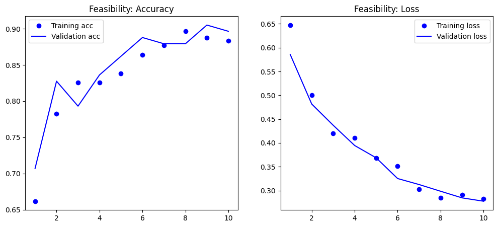
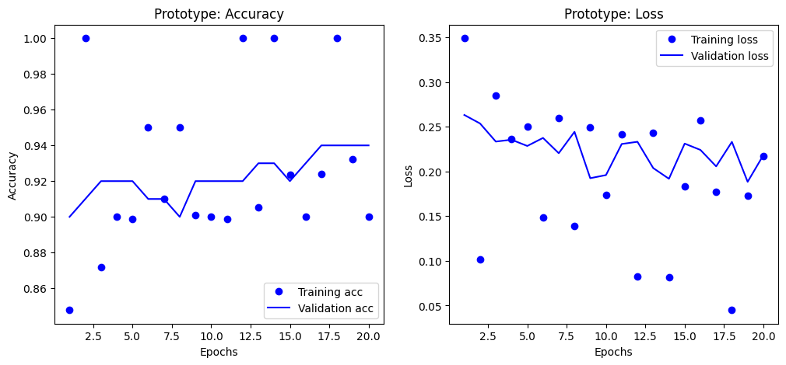

# Precipitation_Classification
This readme documents the machine learning process undertaken to create a binary classification model that can competently identify active precipitation in images. Images from a Kaggle weather dataset were organized into their respective categories, ***precipitation*** and ***no precipitation***. A VGG16 model was trained with transfer learning and techniques such as adding classification layers, early stopping, and learning rate were implemented in order to improve model performance and diagnose anomalies. 

## Overview
This project's aim was to use transfer learning to train a reliable binary classification model on weather images that can identify whether an image contains precipitation. The final model, selected using an early stopping technique to ensure peak performance, achieved an overall F1 Score of 0.92, which indicates an excellent balance between being cautious and being comprehensive.

| Metric | No Precipitation | Precipitation | Overall / Average |
| :--- | :--- | :--- | :--- |
| **Precision** | 0.89 | **0.96** | **0.93** (Weighted Avg) |
| **Recall** | **0.97** | 0.88 | **0.92** (Weighted Avg) |
| **F1-Score**| 0.93 | 0.92 | **0.92** (Weighted Avg) |
| **Accuracy**| - | - | **0.92** |

### Interpretation
When the Model Predicts "Precipitation": It is correct 96% of the time (Precision). This means you can have very high confidence in a rain forecast from this model. If it says it's going to rain, it almost certainly is. False alarms are UNLIKELY

When the Model Predicts "No Precipitation": It correctly identifies 97% of all actual non-rainy days (Recall). This means the model is exceptionally good at confirming clear weather. It almost never mistakes a non-rainy day for a rainy one.

The model successfully detects 88% of all actual rain events (Recall for Precipitation). This is its area with the most room for improvement. While it is very good, it means the model can be slightly cautious, occasionally missing a rain event that does occur.

## DATA
This project uses a weather dataset from kaggle [linked here](https://www.kaggle.com/datasets/muthuj7/weather-dataset). This Kaggle dataset is a weather image dataset organized into the image’s respective category (dew, fogsmog, frost, glaze, hail, lightning, rain, rainbow, rime, sandstorm, snow). Over 500 images were organized into training and validation folders each containing the two categories precipitation and not precipitation. The images themselves are JPEG files. 

## Visuals
The primary visualizations used to assess model performance were accuracy and loss plots via MatPlotLib. These were created with every model created, along with evaluations scores Precision, Recall, F1-Score, and Accuracy. 

- **Feasibility Accuracy / Loss**

These initial feasibility plots shows promise with no obvious overfitting and attractive train and validation trends as they follow each other closely and trend toward where they should. Of course, these are only 10 Epochs so there is much upside from here.

- **Prototype Accuracy / Loss**

The first prototype model immediately stands out as having erratic training accuracy and loss across all epochs. This could be due to a variety of things, though notably the validation accuracy and loss is showing tremendous stability. This means that the erratic behavior of the training data is not immediately necessary to address. We also see that the validation loss is a bit flat at the end. This presents a perfect opportunity to utilize **Early Stopping** from keras to avoid . 

- **Early Stopping Accuracy / Loss**

With Early Stopping implemented, we can see that training data has remained erratic. However, validation accuracy and loss are now more stably trending toward where they should be. The eval metrics results of this model confirm it is our most balanced, high performing, and reliable model.

- **Lower Learning Rate Accuracy / Loss**

Here the erratic training is officially addressed through learning rate. Lowering the lowering rate over tenfold has little to no effect on stability, which leaves me to believe that the instability is due to something more fundamental like the size of the dataset or the complexity of the unfrozen VGG16 model. Again, 

## The Problem

## Future Work 
Improvements to this model would come in the form of bigger dataset size

## Reproduce Results

## Overview of Files in Repo

### File Roles

